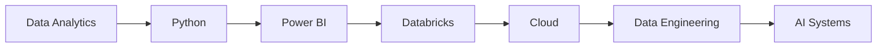

<div align="center">

# ⚡ DAYANAND.OS

```txt
██████╗  █████╗ ██╗   ██╗ █████╗ ███╗   ██╗ █████╗ ███╗   ██╗██████╗
██╔══██╗██╔══██╗╚██╗ ██╔╝██╔══██╗████╗  ██║██╔══██╗████╗  ██║██╔══██╗
██║  ██║███████║ ╚████╔╝ ███████║██╔██╗ ██║███████║██╔██╗ ██║██║  ██║
██║  ██║██╔══██║  ╚██╔╝  ██╔══██║██║╚██╗██║██╔══██║██║╚██╗██║██║  ██║
██████╔╝██║  ██║   ██║   ██║  ██║██║ ╚████║██║  ██║██║ ╚████║██████╔╝
╚═════╝ ╚═╝  ╚═╝   ╚═╝   ╚═╝  ╚═╝╚═╝  ╚═══╝╚═╝  ╚═╝╚═╝  ╚═══╝╚═════╝
```

### Analytics • AI • Automation • Technology

<div align="center">

# ⚡ DAYANAND.OS

```text
╔══════════════════════════════════════════════════════════╗
║                                                        ║
║   ██████╗  █████╗ ██╗   ██╗ █████╗ ███╗   ██╗ █████╗   ║
║   ██╔══██╗██╔══██╗╚██╗ ██╔╝██╔══██╗████╗  ██║██╔══██╗  ║
║   ██║  ██║███████║ ╚████╔╝ ███████║██╔██╗ ██║███████║  ║
║   ██║  ██║██╔══██║  ╚██╔╝  ██╔══██║██║╚██╗██║██╔══██║  ║
║   ██████╔╝██║  ██║   ██║   ██║  ██║██║ ╚████║██║  ██║  ║
║   ╚═════╝ ╚═╝  ╚═╝   ╚═╝   ╚═╝  ╚═╝╚═╝  ╚═══╝╚═╝  ╚═╝  ║
║                                                        ║
╚══════════════════════════════════════════════════════════╝
```

### Analytics • AI • Automation • Engineering

![Profile Views](https://komarev.com/ghpvc/?username=dayanandr&color=blue&style=flat---

## 🖥️ System Status

```yaml
STATUS:      ONLINE 🟢
UPTIME:      Building Every Day
MISSION:     Turn Ideas Into Systems
MODE:        CREATE → LEARN → IMPROVE
VERSION:     v2026.08
```

---

## 👨‍💻 whoami

```yaml
name: Dayanand R

role:
  Operations Engineering Analyst

specialties:
  - Data Analytics
  - Artificial Intelligence
  - Process Automation
  - Business Intelligence

mission:
  Transform complex operational challenges
  into scalable automated systems.

currently_learning:
  - Python
  - Databricks
  - Cloud Technologies
  - Data Engineering
```

---

## 🚀 Featured Projects

### 📊 Workforce Analytics Platform

```text
├── Automated Data Processing
├── Workforce Intelligence
├── Multi-Level Reporting
├── Bradford Factor Analytics
├── Action Planning Framework
└── Executive Performance Insights
```

### 🤖 AI Email Drafting Assistant

```text
├── Human-in-the-Loop AI
├── Intelligent Response Generation
├── Quality Enhancement
├── Faster Turnaround Time
└── Production Deployment
```

---

## 🛠 Technology Stack

### Analytics

```text
Excel
Power Query
Power Pivot
Dashboard Design
Data Visualization
```

### AI

```text
Microsoft Copilot
Generative AI
Prompt Engineering
AI Productivity
```

### Data

```text
SQL
Databricks
Business Analytics
Data Analysis
```

### Development

```text
Python
Power BI
Cloud Technologies
Automation Engineering
```

---

## 🎯 Current Focus

```diff
+ Building Enterprise Analytics Dashboards
+ Creating AI Productivity Agents
+ Automating Repetitive Workflows
+ Exploring Data Engineering
+ Learning Modern Cloud Platforms
+ Building Solutions with Python
```

---

## 📈 System Metrics

```text
Curiosity         ████████████████████ 100%
Creativity        ████████████████████ 100%
Problem Solving   ███████████████████░  95%
Automation        ██████████████████░░  92%
Analytics         ██████████████████░░  92%
Sleep             ██░░░░░░░░░░░░░░░░░   8%
```

---

## 🗺 Growth Roadmap



---

## 📂 Repositories

```text
📁 Workforce Analytics Dashboard
📁 AI Productivity Projects
📁 SQL Portfolio
📁 Databricks Playground
📁 Python Automation Lab
📁 Process Automation Toolkit
📁 Technology Experiments
```

---

## 💡 Core Philosophy

```python
while True:

    learn()

    build()

    automate()

    improve()
```

---

<div align="center">

## ⚡ Engineering Principles

📊 DATA DRIVEN

🤖 AI POWERED

⚙️ AUTOMATION FIRST

♾️ CONTINUOUS IMPROVEMENT

</div>

---

<div align="center">

## 🤝 Connect

💼 LinkedIn  
https://www.linkedin.com/in/dayanandr

📧 Email  
dayanand.r@outlook.com

</div>
