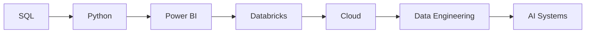

<div align="center">

# 👋 Hi, I'm Dayanand R

### Data Analytics • AI • Automation • Technology

Building intelligent solutions that transform business challenges into measurable outcomes 🚀

</div>

---

## ⚡ Currently Building

```yaml
focus:
  - AI-Powered Productivity Solutions
  - Workforce Analytics Dashboards
  - Process Automation
  - Data Analytics & Reporting
  - Python Projects
  - Cloud & Data Engineering
```

---

## 🏆 Featured Work

### 📊 Workforce Analytics Dashboard

```diff
+ Automated Data Processing
+ Multi-Level Reporting
+ Workforce Intelligence
+ Bradford Factor Analytics
+ Action Planning Framework
```

### 🤖 AI Email Drafting Assistant

```diff
+ Human-in-the-Loop AI
+ Personalized Response Generation
+ Improved Quality & Productivity
+ Faster Turnaround Times
+ Production Environment Deployment
```

---

## 🧠 Tech Universe

```text
📊 ANALYTICS
Excel • Power Query • Power Pivot
Dashboard Design • Data Visualization

🤖 AI & AUTOMATION
Microsoft Copilot • Prompt Engineering
Workflow Automation • AI Productivity

💾 DATA
SQL • Databricks • Business Analytics
Data Analysis

💻 DEVELOPMENT
Python • Power BI
Software Development

☁️ CLOUD
Azure • AWS
```

---

## 🎯 Current Learning Roadmap



---

## 📈 GitHub Activity

<div align="center">

![Stats](https://github-readme-stats.vercel.app/api?username=dayanand-r&theme=githubiv>

---

## 🌍 Connect

💼 LinkedIn: www.linkedin.com/in/dayanandr

📩 Email: dayanand.r@outlook.com

---

<div align="center">

## 🚀 Personal Philosophy

### "Automate what is repetitive.
### Analyze what is meaningful.
### Build what creates impact."

</div>
