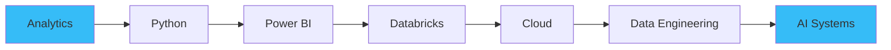

<div align="center">

# ⚡ DAYANAND.EXE

### 🤖 AI • 📊 ANALYTICS • ⚡ AUTOMATION


```txt
SYSTEM STATUS ▰ ONLINE 🟢
CURRENT MODE ▰ BUILD • LEARN • IMPROVE
MISSION      ▰ TURN IDEAS INTO IMPACT
```

</div>

---

## 🧠 SYSTEM.INFO

```yaml
name: Dayanand R

role:
  Operations Engineering Analyst

specialization:
  - Data Analytics
  - Business Intelligence
  - Artificial Intelligence
  - Process Automation

currently_learning:
  - Python
  - Databricks
  - Cloud Technologies
  - Data Engineering

mindset:
  "Curious enough to learn.
   Creative enough to build."
```

---

## 🚀 DEPLOYED PROJECTS

### 📊 Workforce Analytics Dashboard

```diff
+ Automated Reporting Framework
+ Workforce Intelligence System
+ Bradford Factor Analytics
+ Multi-Level Reporting
+ Action Planning Engine
+ Performance Visibility Dashboard
```

### 🤖 AI Email Drafting Assistant

```diff
+ Intelligent Email Generation
+ Human-in-the-Loop AI Workflow
+ Improved Response Quality
+ Enhanced Productivity
+ Faster Turnaround Times
+ Production Environment Deployment
```

---

## ⚙️ TECH MATRIX

<div align="center">

| Analytics | AI & Automation | Data | Engineering |
|------------|------------|------------|------------|
| Excel | Microsoft Copilot | SQL | Python |
| Power Query | Prompt Engineering | Databricks | Power BI |
| Power Pivot | Generative AI | Data Analysis | Cloud |
| Dashboards | Workflow Automation | Business Intelligence | Software Dev |

</div>

---

## 🔥 CURRENTLY BUILDING

```txt
📦 AI Productivity Tools

📦 Analytics Dashboards

📦 Workflow Automation Systems

📦 Python Projects

📦 Data Engineering Foundations

📦 Cloud Skills
```

---

## 🌌 DIGITAL DNA

```txt
Creativity        ████████████████████████

Curiosity         ████████████████████████

Problem Solving   ███████████████████████

Analytics         ██████████████████████

Automation        █████████████████████

Sleep             ██
```

---

## 📈 EVOLUTION PATH



---

## 🧩 PROJECT LAB

```txt
📁 workforce-analytics-dashboard

📁 ai-email-drafting-assistant

📁 process-automation-toolkit

📁 sql-learning-lab

📁 databricks-playground

📁 python-experiments
```

---

## 💭 CORE LOOP

```python
while True:

    learn()

    experiment()

    build()

    automate()

    improve()
```

---

<div align="center">

## 🚀 PHILOSOPHY

### Automate what is repetitive.

### Analyze what is meaningful.

### Build what creates impact.

<br>

### 📊 DATA DRIVEN

### 🤖 AI POWERED

### ⚡ AUTOMATION OBSESSED

### ♾️ CONTINUOUSLY EVOLVING

</div>

---

<div align="center">

## 🌐 CONNECT

💼 **LinkedIn**

www.linkedin.com/in/dayanandr

📧 **Email**

dayanand.r@outlook.com

</div>
