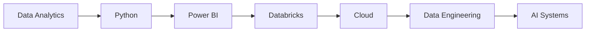

<div align="center">

# ⚡ DAYANAND.OS

```txt
██████╗  █████╗ ██╗   ██╗ █████╗ ███╗   ██╗ █████╗ ███╗   ██╗██████╗
██╔══██╗██╔══██╗╚██╗ ██╔╝██╔══██╗████╗  ██║██╔══██╗████╗  ██║██╔══██╗
██║  ██║███████║ ╚████╔╝ ███████║██╔██╗ ██║███████║██╔██╗ ██║██║  ██║
██║  ██║██╔══██║  ╚██╔╝  ██╔══██║██║╚██╗██║██╔══██║██║╚██╗██║██║  ██║
██████╔╝██║  ██║   ██║   ██║  ██║██║ ╚████║██║  ██║██║ ╚████║██████╔╝
╚═════╝ ╚═╝  ╚═╝   ╚═╝   ╚═╝  ╚═╝╚═╝  ╚═══╝╚═╝  ╚═╝╚═╝  ╚═══╝╚═════╝
```

### Analytics • AI • Automation • Technology

```bash
STATUS      : ONLINE 🟢

UPTIME      : Building Every Day

MISSION     : Turn Ideas Into Systems

MODE        : CREATE > LEARN > IMPROVE

VERSION     : v2026.08
```

</div>

---

# $ whoami

```yaml
name:
  Dayanand R

role:
  Operations Engineering Analyst

speciality:
  - Data Analytics
  - Artificial Intelligence
  - Process Automation
  - Business Intelligence

obsession:
  Turning complicated problems
  into elegant solutions.

currently_learning:
  - Python
  - Databricks
  - Cloud Technologies
  - Data Engineering
```

---

# $ ls deployed-projects

```text
📊 Workforce Analytics Dashboard

├─ Automated Data Processing
├─ Multi-Level Reporting
├─ Workforce Intelligence
├─ Bradford Factor Analytics
├─ Action Planning Framework
└─ Performance Insights

```

```text
🤖 AI Email Drafting Assistant

├─ Human-in-the-Loop AI
├─ Intelligent Draft Generation
├─ Better Response Quality
├─ Faster Turnaround Times
└─ Production Deployment

```

---

# $ cat tech-stack.json

```json
{
  "Analytics": [
    "Excel",
    "Power Query",
    "Power Pivot",
    "Dashboard Design",
    "Data Visualization"
  ],

  "AI": [
    "Microsoft Copilot",
    "Generative AI",
    "Prompt Engineering",
    "AI Productivity"
  ],

  "Data": [
    "SQL",
    "Databricks",
    "Business Analytics",
    "Data Analysis"
  ],

  "Development": [
    "Python",
    "Power BI",
    "Cloud Technologies"
  ]
}
```

---

# $ current-focus

```diff
+ Building Analytics Dashboards

+ Creating AI Productivity Tools

+ Automating Repetitive Work

+ Exploring Data Engineering

+ Learning Cloud Technologies

+ Building With Python
```

---

# $ system-metrics

```txt
Curiosity             ████████████████████ 100%

Creativity            ████████████████████ 100%

Automation            ██████████████████░░  92%

Analytics             ██████████████████░░  92%

Problem Solving       ███████████████████░  95%

Sleep                 ██░░░░░░░░░░░░░░░░░   8%
```

---

# $ roadmap



---

# $ repositories

```txt
📁 Workforce Analytics Dashboard

📁 AI Productivity Projects

📁 SQL Portfolio

📁 Databricks Playground

📁 Python Automation Lab

📁 Process Automation Toolkit

📁 Technology Experiments
```

---

# $ philosophy

```bash
while(alive){

    learn();

    build();

    automate();

    improve();

}
```

---

<div align="center">

### 🚀 DATA DRIVEN

### 🤖 AI POWERED

### ⚡ AUTOMATION OBSESSED

### ♾️ CONTINUOUSLY EVOLVING

</div>

---

<div align="center">

## CONNECT

💼 www.linkedin.com/in/dayanandr

📧 dayanand.r@outlook.com

</div>
